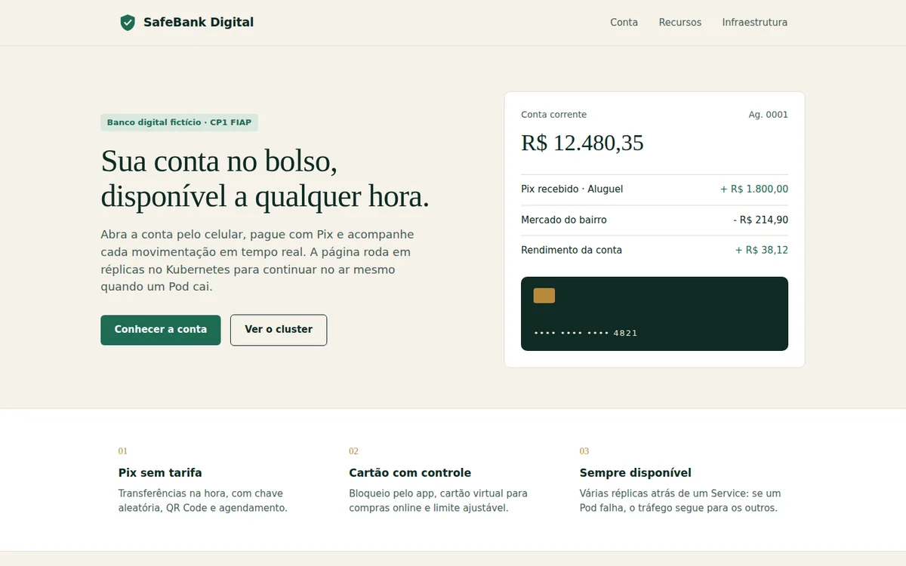
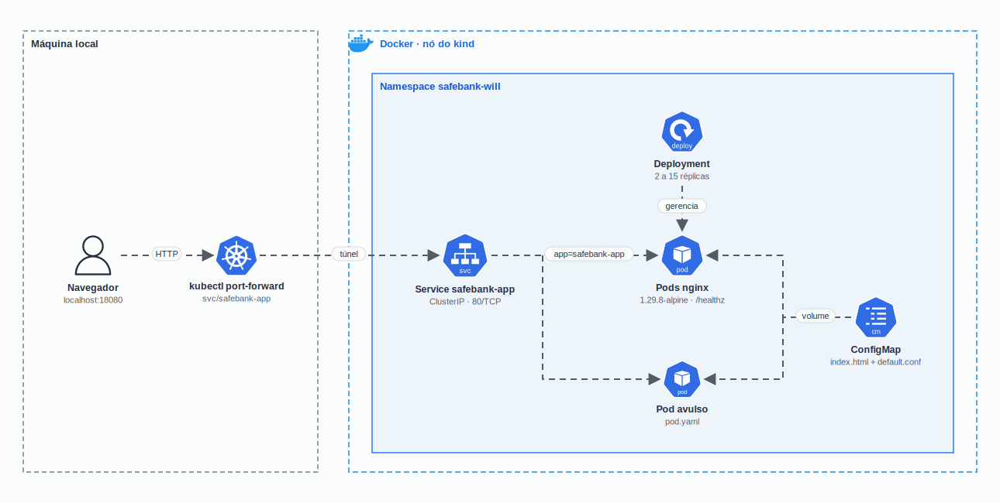

<h1 align="center">
  CP1 - SafeBank Digital no Kubernetes
</h1>

<p align="center">
  
</p>

<p align="center">
  <a href="https://skillicons.dev">
    
  </a>
</p>

## Qual a finalidade do projeto?

Checkpoint 1 da disciplina de **Kubernetes** (FIAP, setembro de 2025). O desafio era publicar a página do banco fictício **SafeBank Digital** em um cluster Kubernetes local usando os objetos básicos: **Pod**, **Service ClusterIP** e **Deployment** com réplicas, escolher uma estratégia de exposição e provar que a aplicação escala.

A entrega original usava a página padrão do nginx. Nesta versão a página do SafeBank vem de um **ConfigMap**, a imagem tem **tag fixa**, os containers têm **probes** e **limites de recursos**, e um script valida tudo de ponta a ponta no **kind**.

## Arquitetura

<p align="center">
  
</p>

## O que foi construído

### Manifestos

| Arquivo | Objeto | O que faz |
|---|---|---|
| `k8s/namespace.yaml` | Namespace `safebank-will` | Isola os recursos do projeto |
| `k8s/configmap.yaml` | ConfigMap `safebank-site` | Guarda a página `index.html` e a configuração `default.conf` do nginx |
| `k8s/deployment.yaml` | Deployment `safebank-app` | 2 réplicas do nginx com a página montada do ConfigMap |
| `k8s/pod.yaml` | Pod `safebank-app` | Exemplo unitário com o mesmo rótulo do Deployment |
| `k8s/service.yaml` | Service `safebank-app` (ClusterIP) | Encaminha a porta 80 para os Pods com `app=safebank-app` |

### Melhorias em relação à entrega original

| Ponto | Antes | Agora |
|---|---|---|
| Página | Página padrão do nginx | Página do SafeBank via ConfigMap, com o nome do Pod que respondeu (SSI do nginx) |
| Imagem | `nginx:latest` | `nginx:1.29.8-alpine` |
| Saúde | Sem probes | `readinessProbe` e `livenessProbe` em `/healthz` |
| Recursos | Sem limites | `requests` de 25m/32Mi e `limits` de 200m/128Mi |
| Namespace | Criado na mão com `kubectl create ns` | Declarado em `k8s/namespace.yaml` |
| Validação | Prints | `scripts/validar.sh` e GitHub Actions com kubeconform e kind |

### Estratégia de exposição

**`kubectl port-forward` sobre o Service ClusterIP.** É simples, segura e ideal para ambiente local: não exige LoadBalancer, Ingress nem portas abertas no host, e funciona igual no kind e no Minikube. Para produção, o caminho seria um Ingress Controller ou um Service LoadBalancer com DNS e HTTPS.

## Tecnologias utilizadas

- **Kubernetes no kind:** testado com o nó v1.37; cluster local de um nó rodando dentro do Docker;
- **nginx 1.29.8 (Alpine):** servidor da página, com SSI para mostrar o Pod;
- **HTML e CSS:** página do SafeBank, sem bibliotecas nem fontes externas;
- **kubeconform:** validação dos manifestos contra o esquema do Kubernetes;
- **GitHub Actions:** validação e teste no kind a cada push e pull request.

## Estrutura do repositório

```text
fiap-k8s-cp1/
├── k8s/
│   ├── namespace.yaml     # Namespace safebank-will
│   ├── configmap.yaml     # Página do SafeBank + default.conf do nginx
│   ├── deployment.yaml    # Deployment com 2 réplicas, probes e recursos
│   ├── pod.yaml           # Pod avulso (exemplo unitário)
│   └── service.yaml       # Service ClusterIP
├── scripts/validar.sh     # Aplica, acessa pela porta local e escala para 15
├── docs/
│   ├── arch.gif           # Diagrama
│   ├── demo.webp          # Demo da página
│   └── prints/            # Evidências da entrega original
└── .github/workflows/validacao.yml
```

## Fluxo de funcionamento

1. O `kubectl port-forward` abre um túnel de `localhost` até o Service `safebank-app`.
2. O Service escolhe um dos Pods com o rótulo `app=safebank-app` (os do Deployment e o Pod avulso).
3. O nginx do Pod entrega o `index.html` montado do ConfigMap e, via SSI, escreve na página o nome do Pod que respondeu.
4. O Deployment mantém o número de réplicas pedido: se um Pod cai, outro é criado; com `kubectl scale`, sobe para 15.
5. As probes em `/healthz` tiram do Service um Pod que não responde e reiniciam o container se ele travar.

## Como rodar

Pré-requisitos: Docker, `kubectl` e [kind](https://kind.sigs.k8s.io/) (ou Minikube).

```bash
kind create cluster --name safebank
kubectl apply -f k8s/namespace.yaml
kubectl apply -f k8s/
kubectl -n safebank-will rollout status deploy/safebank-app
kubectl -n safebank-will port-forward svc/safebank-app 8080:80
# abra http://localhost:8080
```

Escalar as réplicas:

```bash
kubectl -n safebank-will scale deployment safebank-app --replicas=15
kubectl -n safebank-will get pods
```

Para apagar tudo: `kind delete cluster --name safebank`.

## Como validar a entrega

Com o cluster criado e o `kubectl` apontando para ele:

```bash
./scripts/validar.sh
```

O script confere:

- os manifestos aplicados e o Deployment com 2 réplicas prontas;
- o Pod avulso em `Ready`;
- a página acessível pelo Service (`/healthz` e o texto "SafeBank Digital");
- a escala para 15 réplicas, todas prontas, e a volta para 2.

O mesmo script roda no GitHub Actions dentro de um cluster kind, depois do kubeconform.

### Evidências da entrega original

Prints feitos no Windows durante o checkpoint, com a página padrão do nginx:

| Print | O que mostra |
|---|---|
| [01](docs/prints/01-kind-create-cluster.png) | Criação do cluster `cluster-safebank-will` no kind |
| [02](docs/prints/02-docker-desktop-node.png) | Nó do kind rodando no Docker Desktop |
| [03](docs/prints/03-namespace.png) | Namespace `safebank-will` criado |
| [04](docs/prints/04-apply-e-recursos.png) | `kubectl apply` dos manifestos e recursos criados |
| [05](docs/prints/05-nginx-port-forward.png) | Página acessada pelo port-forward |
| [06](docs/prints/06-scale-15-replicas.png) | Deployment escalado para 15 réplicas |
| [07](docs/prints/07-historico-comandos.png) | Histórico dos comandos executados |

## Autor

**William Coelho** · RM 556336 · [@willtechdev](https://github.com/willtechdev)
